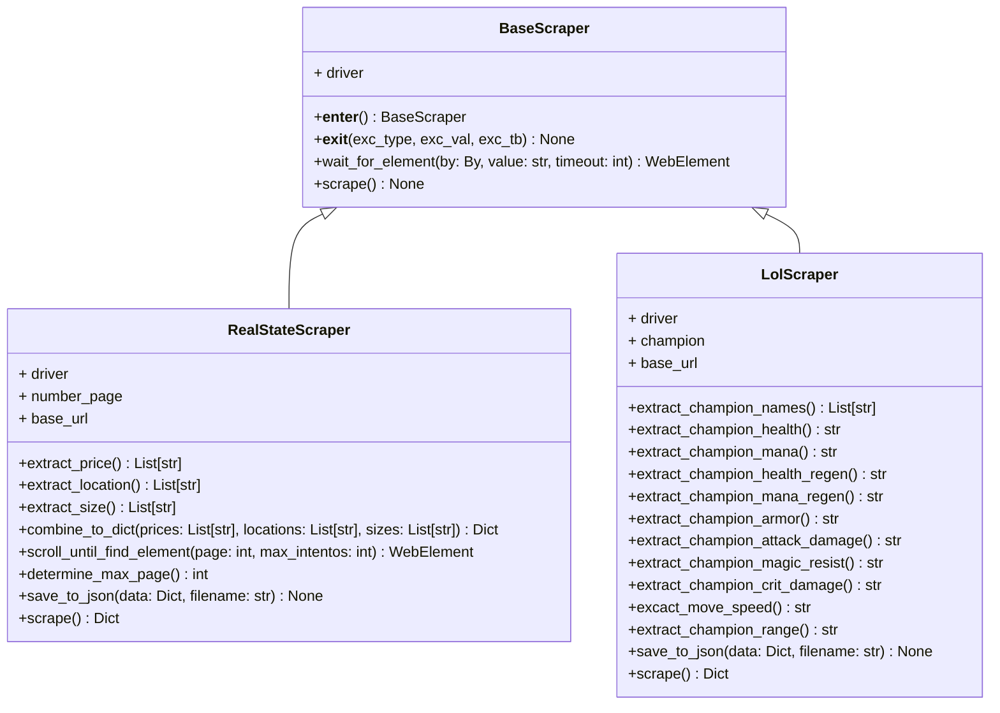
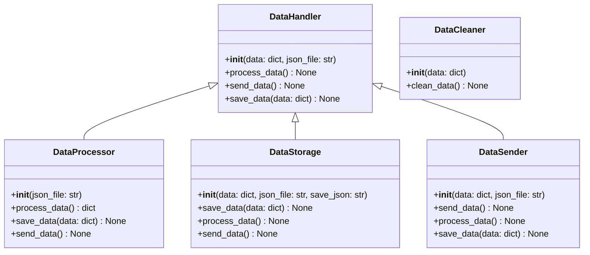

# Sistema-De-Webscrapping

# Definición de alternativa

## Contexto y Motivación

El **web scraping** es una técnica que permite automatizar la extracción de datos de sitios web, facilitando el acceso y análisis de información de manera eficiente.
Entre sus principales ventajas están:

- **Automatización**: Reduce el tiempo y esfuerzo de la recopilación manual.
- **Eficiencia**: Procesa grandes volúmenes de datos rápidamente.
- **Acceso en tiempo real**: Garantiza información actualizada.
- **Flexibilidad**: Aplicable a diversos tipos de sitios web y datos.
- **Estructuración de datos**: Convierte datos no organizados en formatos como CSV o JSON.

Este proyecto se eligió porque, entre las alternativas disponibles, tiene un objetivo final claro: crear una herramienta práctica que permita analizar datos de sitios dinámicos, como plataformas de comercio. Además, la implementación con principios de **Programación Orientada a Objetos** garantiza un diseño modular y adaptable.

<ins>Mas informacion en:</ins> [Web scraping: qué es, funcionamiento y ventajas](https://www.esic.edu/rethink/tecnologia/web-scraping-que-es-funcionamiento-ventajas-c) 

##  Objetivos:

- ## Objetivo General
  - Desarrollar una aplicación que emule un sistema de **web scraping** utilizando **Python** y los principios de **Programación Orientada a Objetos (POO)** enseñados en clase, con el fin de extraer, organizar y analizar datos de sitios web dinámicos.

 - ## Objetivos Específicos
    1. Desarrollar un sistema de scraping que permita extraer texto de sitios web tipo **wiki**, identificando y organizando la información relevante.
    2. Implementar un proceso de extracción de publicaciones de plataformas de bienes raíces, generar reportes con los datos recolectados y organizarlos por ciudad o localidad.
    3. Aplicar principios de **POO** para estructurar el código en clases y objetos que faciliten la reutilización, extensión y mantenimiento del sistema.

## Justificacion

Este proyecto se eligió por su enfoque práctico y aplicable en el mundo real. El **web scraping** permite automatizar la recolección de datos de sitios dinámicos, lo cual es útil en áreas como el análisis de mercado o bienes raíces. Además, aplicar **Programación Orientada a Objetos (POO)** garantiza un código modular, escalable y fácil de mantener, lo que favorece su reutilización y expansión futura.

Este proyecto no solo aborda un problema concreto de recolección y organización de datos, sino que también brinda experiencia valiosa en herramientas de programación avanzadas y en la creación de soluciones eficientes y adaptables.

# Diagrama De Clases

## Scraper


## Data

## Urls

```mermaid
classDiagram
    class Url {
        + url  
        +change_url(**kwargs) str
    }

    class RSUrl {
        +__init__(base_url: str)
        +change_url(modo: str, ciudad: str, barrio: Optional[str]) str
    }

    class WikiUrl {
        +__init__(base_url: str)
        +change_url(champion: str) str
    }
    Url <|-- RSUrl
    Url <|-- WikiUrl
````
## **Solución Preliminar**

### **Clases y Componentes**

1. **`Url`**:
   - Se encarga de manejar y validar URLs.

2. **`BaseScraper`**:
   - Clase genérica que realiza solicitudes HTTP y devuelve el contenido HTML.

3. **Clases especializadas**:
   - **`LOLScraper`**:
     - Diseñada para extraer estadísticas de campeones desde la wiki de League of Legends.
     - Utiliza herencia del `BaseScraper` y se compone de un `LOLUrl`

   - **`RealStateScraper`**:
     - Diseñada para extraer información de propiedades desde sitios de bienes raíces.
     - Utiliza herencia del `BaseScraper`
     - Datos que extraerá:
       - **Precio**: Muestra el precio de cada propiedad.
       - **Tamaño**: Área en metros cuadrados.
       - **Ciudad**: Ubicación de la propiedad.

4. **Excepciones Personalizadas**:
   - Definen errores específicos como `ElementNotFound`, `WebDriverError`, etc.

5. **Clases de la Interfaz Gráfica**:

   Se usara la libreria **PyQT6** para facilitar el trabajo

  - **`VentadaArriendos`**:
      - Ventana para seleccionar opciones de scraping de arriendos.

  - **`VentanaBarrio`**:
      - Ventana para ingresar datos de scraping por barrio.

  - **`VentanaCiudad`**:
      - Ventana para ingresar datos de scraping por ciudad.

  - **`VentanaDatos`**:
      - Ventana para mostrar los datos scrapeados.
  - **`VentanaDatosLol`**:
      - Ventana para mostrar los datos scrapeados de un campeón de LoL
  - **`VentanaLol`**:
      - Ventana para ingresar el nombre de un campeón de LoL y realizar el scraping.

  - **`VentanaPrincipal`**:
     - Ventana principal que permite seleccionar entre scraping de arriendos o scraping de LoL.

  6. **Clases Del Manejo de Datos**:

  - **`DataHandler`**:
      - Clase base abstracta para manejar la manipulación y distribución de los datos.
      - Define los métodos comunes `process_data()`, `send_data()` y `save_data()`.

  - **`DataStorage`**:
     - Se encarga de almacenar los datos procesados en archivos, como JSON o CSV.
     - Hereda de `DataHandler` y sobrescribe el método `save_data()` para guardar los datos en el formato especificado.
    - **Datos almacenados**:
       - Guarda los datos procesados o limpiados, listos para ser utilizados o exportados.

- **`DataProcessor`**:
     - Se encarga de procesar y limpiar los datos que recibe.
     - Hereda de `DataHandler` y sobrescribe los métodos `process_data()` y `clean_data()`
     - **Datos procesados**:
       - Convierte los datos crudos en un formato estandarizado, limpio y listo para su uso.


- **`DataSender`**:
     - Se encarga de enviar los datos procesados a otros módulos, como almacenamiento, interfaz gráfica o reporte.
     - Hereda de `DataHandler` y sobrescribe el método `send_data()`.
     - **Flujo de datos**:
       - Envía los datos procesados a los destinos correspondientes: `DataStorage` (para guardar), `UIManager` (para mostrar en la interfaz gráfica) o `ReportView` (para exportar los datos).

- **`DataCleaner`**:
     - Se encarga de eliminar los archivos o datos que ya no son necesarios una vez finalizada la ejecución del programa.

# **Estructura de Archivos**
```
The ScrapeRift/
│── init.py
│── src/
│ ├── main.py
│ ├── data/
│ │ ├── DataCleaner.py
│ │ ├── DataHandler.py
│ │ ├── DataProcessor.py
│ │ ├── DataSender.py
│ │ ├── DataStorage.py
│ │ ├── init.py
│ ├── GUI/
│ │ ├── VentanaArriendos.py
│ │ ├── VentanaBarrio.py
│ │ ├── VentanaCiudad.py
│ │ ├── VentanaDatos.py
│ │ ├── VentanaDatosLol.py
│ │ ├── VentanaLol.py
│ │ ├── VentanaPrincipal.py
│ │ ├── init.py
│ ├── modulos/
│ │ ├── init.py
│ │ ├── BaseScraper.py
│ │ ├── RealStateScraper.py
│ │ ├── UrlManager.py
│ │ ├── WikiScraper.py
| ├── requirements.txt
| ├── readme.md
```
# Importante
### Es necesario descargar el chromedriver en la ultima versión que se tenga el navegador, pues este fue implementado para el proyecto. Por defecto en los archivos del proyecto viene incluido un driver, sin embargo es posible que por incopatibilidad de versiones no sea posible ejecutar el programa. 
### En el siguiente link se encuentran las ultimas versiones del webdriver https://googlechromelabs.github.io/chrome-for-testing/
### Verifica que la version del driver coincida con la versión del navegador Chrome. Se descarga y se extrae el Chrome.exe en el paquete "modulos" del proyecto  


# Implementación

## Entorno Virual
Para ejecutar este proyecto es recomendable hacerlo con un entorno virtual. En este caso usaremos de ejemplo miniconda para crear el entorno

### 1. Instalar miniconda (si no se tiene)
Puedes ir al siguiente link y seguir los pasos para instalar la aplicación requerida https://www.anaconda.com/download

### 2. Crear el entorno virtual
Vas a ejecutar los siguientes comandos en orden en el Anaconda Prompt o en el terminal que tengas

```bash
conda create -n webscrapping-env python=3.9
```

### 3. Ir a la carpeta del proyecto
Una vez descargado el paquete del proyecto, en el explorador de archivos copea el path en el que está guardado y ejecuta este comando

```bash
cd "PEGA AQUI EL PATH"
```
### 4. Activar el entorno
Se activa el entorno para que la instalación de librerias se haga de manera correcta

```bash
avtivate webscrapping-env
```

### 5. Instalación de requerimientos
En este paso instalaremos las librerias necesarias para la ejecución del programa. Para ello usaremos el **requirements.txt** que viene con el paquete del proyecto y ejecutamos el siguiente comando

```bash
pip install -r requirements.txt
```
### 6. Ejecución del proyecto
Finalmente ejecutamos el proyecto con el siguiente comando

```bash
python src/main.py
```
