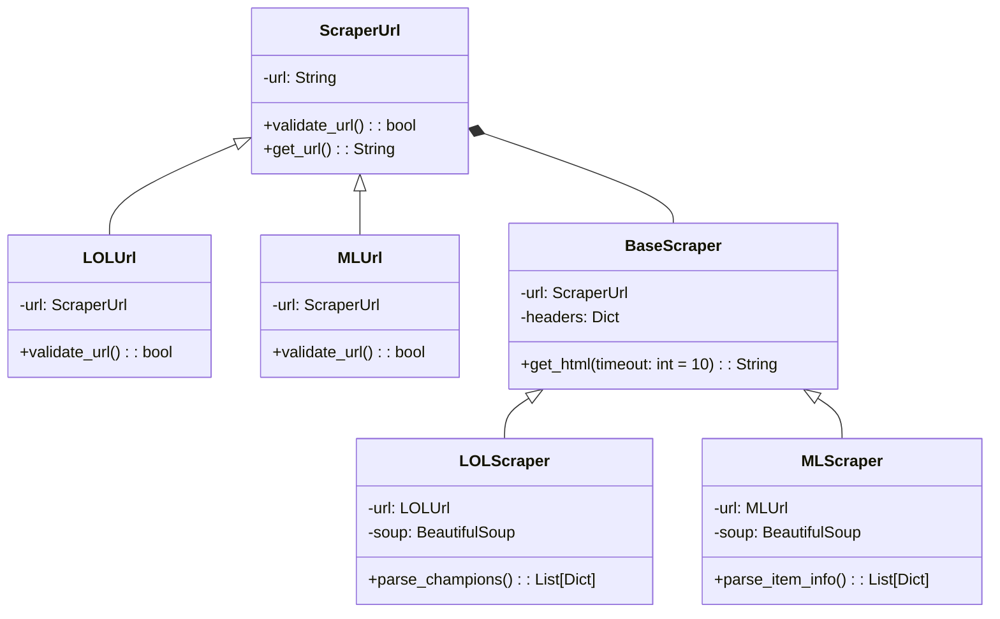
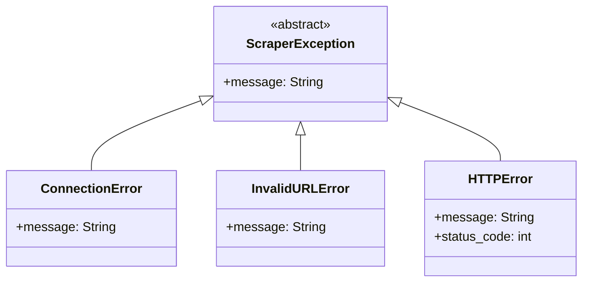

# Sistema-De-Webscrapping

```mermaid

classDiagram
    class ScraperUrl {
        -url: String
        +validate_url(): bool
        +get_url(): String
    }

    class LOLUrl {
        -url: ScraperUrl
        +validate_url(): bool
    }

    class MLUrl {
        -url: ScraperUrl
        +validate_url(): bool 
    }

    class BaseScraper {
        -url: ScraperUrl
        -headers: Dict
        +get_html(timeout: int = 10): String
    }


    class LOLScraper {
        -url: LOLUrl
        -soup: BeautifulSoup
        +parse_champions(): List[Dict]
    }

    class MLScraper {
        -url: MLUrl
        -soup: BeautifulSoup
        +parse_item_info(): List[Dict]
    }

    ScraperUrl *-- BaseScraper
    ScraperUrl <|-- LOLUrl
    ScraperUrl <|-- MLUrl
    BaseScraper <|-- LOLScraper
    BaseScraper <|-- MLScraper

```

```mermaid

classDiagram
    class ScraperException {
        <<abstract>>
        +message: String
    }

    class ConnectionError {
        +message: String
    }


    class InvalidURLError {
        +message: String
    }

    class HTTPError {
        +message: String
        +status_code: int
    }

    ScraperException <|-- ConnectionError
    ScraperException <|-- InvalidURLError
    ScraperException <|-- HTTPError
```
