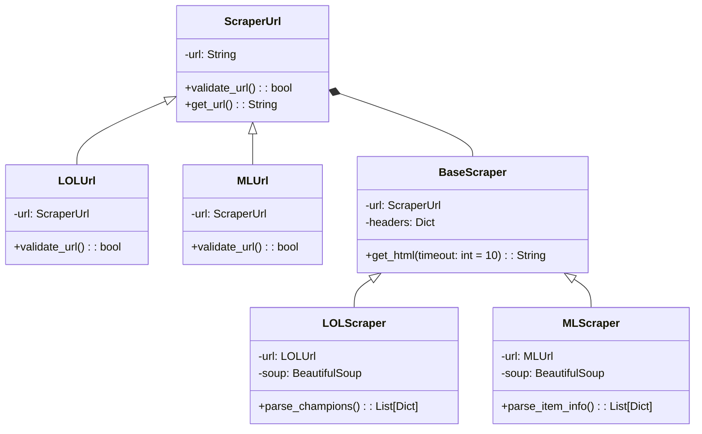
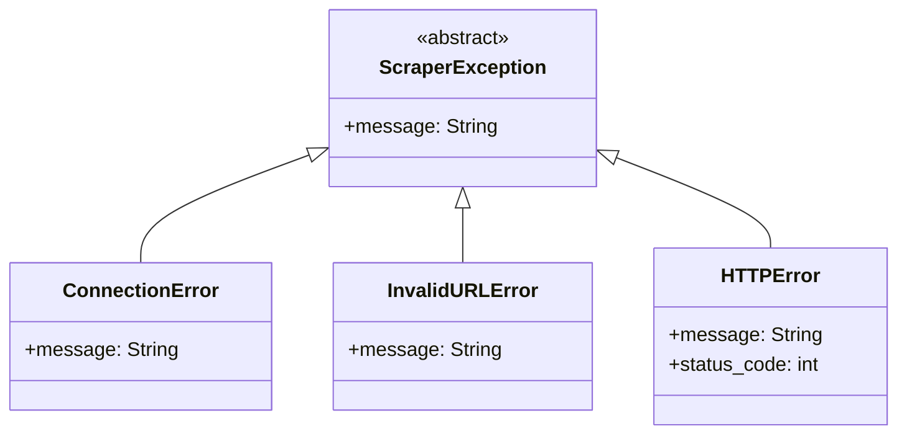

# Sistema-De-Webscrapping

# Definición de alternativa

## Contexto y Motivación

El **web scraping** es una técnica que permite automatizar la extracción de datos de sitios web, facilitando el acceso y análisis de información de manera eficiente. En un mundo impulsado por datos, esta herramienta es clave para tomar decisiones fundamentadas y optimizar procesos.

Entre sus principales ventajas están:

- **Automatización**: Reduce el tiempo y esfuerzo de la recopilación manual.
- **Eficiencia**: Procesa grandes volúmenes de datos rápidamente.
- **Acceso en tiempo real**: Garantiza información actualizada.
- **Flexibilidad**: Aplicable a diversos tipos de sitios web y datos.
- **Estructuración de datos**: Convierte datos no organizados en formatos como CSV o JSON.

Este proyecto se eligió porque, entre las alternativas disponibles, tiene un objetivo final claro: crear una herramienta práctica que permita analizar datos de sitios dinámicos, como plataformas de comercio. Además, la implementación con principios de **Programación Orientada a Objetos** garantiza un diseño modular y adaptable.

<ins>Mas informacion en:</ins> [Web scraping: qué es, funcionamiento y ventajas](https://www.esic.edu/rethink/tecnologia/web-scraping-que-es-funcionamiento-ventajas-c) 

##  Objetivos:

- ## Objetivo General
  - Desarrollar una aplicación que emule un sistema de **web scraping** utilizando **Python** y los principios de **Programación Orientada a Objetos (POO)**, con el fin de extraer, organizar y analizar datos de sitios web dinámicos.

 - ## Objetivos Específicos
    1. Desarrollar un sistema de scraping que permita extraer texto de sitios web tipo **wiki**, identificando y organizando la información relevante.
    2. Implementar un proceso de extracción de publicaciones de plataformas de comercio o bienes raíces, generar reportes con los datos recolectados y organizarlos por ciudad o localidad.
    3. Aplicar principios de **POO** para estructurar el código en clases y objetos que faciliten la reutilización, extensión y mantenimiento del sistema.

## Justificacion

Este proyecto se eligió por su enfoque práctico y aplicable en el mundo real. El **web scraping** permite automatizar la recolección de datos de sitios dinámicos, lo cual es útil en áreas como el análisis de mercado o bienes raíces. Además, aplicar **Programación Orientada a Objetos (POO)** garantiza un código modular, escalable y fácil de mantener, lo que favorece su reutilización y expansión futura.

Este proyecto no solo aborda un problema concreto de recolección y organización de datos, sino que también brinda experiencia valiosa en herramientas de programación avanzadas y en la creación de soluciones eficientes y adaptables.

# Diagrama De Clases

## Alcance Del Proyecto, en la solucion

